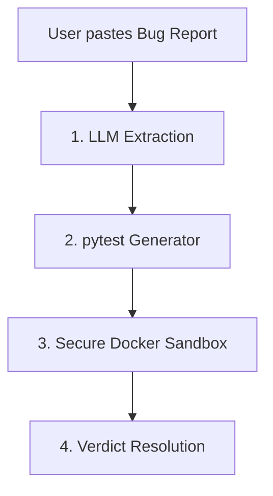

# RepoDoctor 🩺

RepoDoctor is an agentic AI-powered bug reproduction and verification tool. It automatically analyzes issue reports, extracts structured reproduction claims, generates standalone tests, executes them inside a secure Docker sandbox, and returns a clear, definitive verdict status (`reproduced`, `not_reproducible`, or `insufficient_info`).

---

## 🚀 Live Demo & Deployments

- **Frontend (Vercel)**: `https://repodoctor-frontend.vercel.app` (Placeholder)
- **Backend (Render/Railway)**: `https://repodoctor-backend.up.railway.app` (Placeholder)

---

## ⚙️ How It Works

RepoDoctor operates using a structured 4-step pipeline:



1. **LLM Extraction**: An LLM (Gemini, OpenAI, Groq, Grok, or OpenRouter) extracts the target function, input arguments, expected behavior, and observed failure.
2. **pytest Generator**: A Python test generator dynamically creates a standalone `test_generated.py` file with exact assertions (including `pytest.raises` for exceptions).
3. **Secure Sandbox**: The generated test runs inside a highly restricted, read-only Docker container (no network access, non-root user, CPU/RAM caps, and a strict 10s execution timeout).
4. **Verdict Resolution**: Returns one of three verdicts:
   - `reproduced`: The code behaves differently than expected (assertion failure).
   - `not_reproducible`: The test passes and no discrepancy is found.
   - `insufficient_info`: Missing details, timeouts, or syntax/compilation errors.

---

## 🛠️ Local Development Setup

### Prerequisites
- Python 3.9+
- Node.js 18+
- Docker (running locally)

### 1. Backend Setup

From the root directory:
```bash
# Create and activate virtual environment
python3 -m venv .venv
source .venv/bin/activate

# Install requirements
pip install -r backend/requirements.txt

# Configure environment variables
# Copy .env.example or create .env and add your API keys (Gemini, OpenAI, Groq, Grok, or OpenRouter)
cp .env.example .env
```

To run sandbox tests locally, you **must build** the restricted sandbox Docker image:
```bash
docker build -t repodoctor-sandbox -f sandbox/Dockerfile .
```

Start the FastAPI backend server:
```bash
PYTHONPATH=. uvicorn backend.main:app --port 8000 --reload
```

---

### 2. Frontend Setup

From the `frontend` directory:
```bash
# Install dependencies
npm install

# Start the Next.js development server
npm run dev -- -p 3000
```
Open **[http://localhost:3000](http://localhost:3000)** in your browser.

---

## 🐳 Deployment Configurations

### Frontend (Vercel)
The frontend is pre-configured with [vercel.json](file:///Users/apple/Desktop/repodoctor/frontend/vercel.json) for instant deployment to Vercel:
1. Connect your repository to Vercel.
2. Set the root directory to `frontend`.
3. Configure the following environment variable:
   - `NEXT_PUBLIC_API_URL`: The public URL of your deployed backend service.

### Backend (Render & Railway)
The backend includes blueprints for Render ([render.yaml](file:///Users/apple/Desktop/repodoctor/render.yaml)) and Railway ([railway.json](file:///Users/apple/Desktop/repodoctor/railway.json)):
1. Create a Web Service pointing to the root repository.
2. Set the startup command to:
   `PYTHONPATH=. uvicorn backend.main:app --host 0.0.0.0 --port $PORT`
3. Add the API keys you wish to activate as environment variables (e.g. `GROQ_API_KEY`, `OPENROUTER_API_KEY`, etc.).
4. **Note:** Since the backend runs test assertions inside local Docker containers, your deployment environment must support **Docker-in-Docker (DinD)** or run on a virtual machine/private server (VPS) with Docker privileges to execute the sandbox loop.

---

## 🧪 Testing the Pipeline

To run the complete offline test suite (mocking Docker and LLMs):
```bash
PYTHONPATH=. pytest
```
